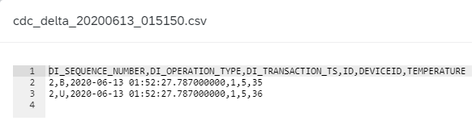
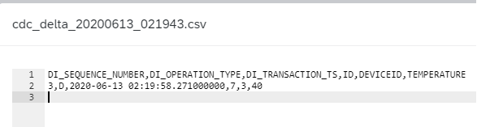
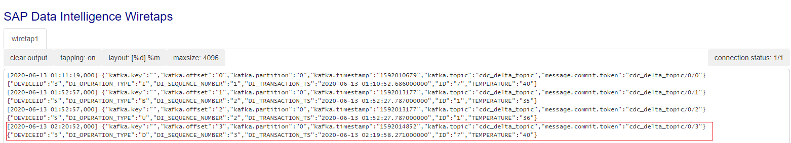

# Buid Log-based integration with SAP Data Intelligence

Log-based integration is getting popular for integrating different data systems. By capturing the changes in a database and continually apply the same changes to derived data systems, the data in the derived systems is match with the data in the database as long as the message ordering of changed data stream is preserved. The derived data systems are consumers of the changed data stream, as illustrated in below figure.<br><br>


> The derived data systems are downstream consumers, in practice, they might be indexes, caches, analytics systems, etc. 

In order to build a log-based intergtation, we need two critical tools:
- A CDC tool for capturing database changes.
- A message borker for persisting messages stream while preserving the message ordering.

In this toturial, we want to explore how to achieve data integration between soure database and various other derived data systems using a log-based approach in SAP Data Intelligence.

### CDC
Change data capture(CDC) is the process of observing all data changes written to a database and extracting them in a form in which they can be replicated to other systems. 

SAP Data Intelligence 3.0 introduced the table Replicator operator which allows capturing delta changes for different databases. Table Replicator operator effectively implements the CDC using an approach of trigger-based replication. For more detail, see https://help.sap.com/viewer/97fce0b6d93e490fadec7e7021e9016e/Cloud/en-US/79fcadb91f584f868a6662111b92f6e7.html.

### Kafka
Apache Kafka is a message broker which persists the messages it receives. It provides a total ordering of the messages inside each partition. SAP Data Intelligence has built-in Kafka operators which allows us to use a Kafka cluster.

Next, we will see how to leavage these two operators to implement a concret integration scenario.

## Getting started
We have a HANA database table, and its schema is illustrated as below.<br><br>


The table content is illustrated as below.<br><br>


The table initially contains 6 records.
> For simplicity, we only use factitious data for demonstration purpose.

The scenario involves two tasks.
1. An initial loading of the data in source table to a taget file in Data Intelligence local file system.
2. Continuously capture source table changes(Delta extraction), publish the change messages into a Kafka topic and let derived systems consume those changes.

We will create separate graphs for these two tasks.

## Initial loading [(Graph source code)](https://github.com/Andyyh2005/log-based-integration-with-DI/blob/master/src/vrep/vflow/graphs/CDC_InitialLoading_test/graph.json)
The following figure illustrates the initial loading graph:<br><br>


Table replicator operator configuration is illustrated as below.<br><br>


The important cofiguration parameters are marked in red box.
> Note that the **deltaGrapMode** is set to Manual. This ensures the graph would complete its execution once the intial loading completed. Otherwise, the graph would run indefinitely to track further delta changes.

Now run the graph and verify the target file has been generated.<br><br>


Also, open the file and verify the table content has been replicated successfully.<br><br>


> Note that delta record provides a row type like Insert (I), Update (U), Delete (D), Before Image (B), Unknown (X), and so on. In our case of initial loading, the row type is I which means insert record. The row type in the message is named as DI_OPERATION_TYPE. 

Our initial loading task has been finished successfully. Next, let's turn to the Delta extraction task.

## Delta extraction[(Graph source code)](https://github.com/Andyyh2005/log-based-integration-with-DI/blob/master/src/vrep/vflow/graphs/CDC_DeltaExtraction_test/graph.json)
The following figure illustrates the Delta extraction graph:<br><br>


Let's take an overview of the dataflow sequence.
- The constant generator operator will trigger the Table Replicator to begin the CDC delta tracking.
- The Table Replicator operator(labeled as "CDC (delta tracking)") will replicate the database changes to a tagret file like what happend in the initial loading. 
- The JS operator(labeled as "Remove path prefix") will remove the '/vrep' prefix from the target file path. The prefix was added by Table Replicator operator which will prevent the downstream Read File operator from finding the file if we do not remove it.
- The Read File operator(labeled as "Read Delta File") will read the target file content and send it to downstream JS operator.
- The JS operator(labeled as "Parse & send changes") will parse the received file content and send the parsed messages into Kafka topic.
- The Kakfa Producer operator will receieve the incoming messages and publish them into the specified topic on the Kafka cluster.
- The Kafka Consumers receieve the messages from the topic on the Kafka cluster.
- The Connected Wiretap opertors(labeled as "Change consumer1" and "Change consumer2") act as the derived data system consume and apply the receieved messages.

Now let's look at the configuraion of some operators.

### Table Replicator
Its configuration is illustrated as below.<br><br>


Some of the important cofiguration parameters are marked in red box.
> Note that the **deltaGrapMode** is set to "Polling Interval", and the **maxPollingInterval** is set to "60". This ensures the graph would run indefinitely to track delta changes, and Table Replicator will polling the delta changes within one minute.

### The "Remove path prefix" JS operator 
Its script code is shown as below.
```
$.setPortCallback("input",onInput);

function onInput(ctx,s) {
    var msg = {};

    msg.Attributes = {};
    for (var key in s.Attributes) {
        msg.Attributes[key] = s.Attributes[key];
    }
    
    msg.Body = s.Body.replace(/^\/vrep/, '');
    $.output(msg);
}
```
It simply removes the "/vrep" prefix from the receieved message body which contains the target file path.

### The "Parse & send changes JS operator 
Its script code is shown as below.
```
$.setPortCallback("input",onInput);

function isByteArray(data) {
    switch (Object.prototype.toString.call(data)) {
        case "[object Int8Array]":
        case "[object Uint8Array]":
            return true;
        case "[object Array]":
        case "[object GoArray]":
            return data.length > 0 && typeof data[0] === 'number';
    }
    return false;
}

function onInput(ctx,s) {
    var inbody = s.Body;
    var inattributes = s.Attributes;
    
    var msg = {};
    msg.Attributes = {};
    for (var key in inattributes) {
        msg.Attributes[key] = inattributes[key];
    }

    // convert the body into string if it is bytes
    if (isByteArray(inbody)) {
        inbody = String.fromCharCode.apply(null, inbody);
    }
    
    var lines = inbody.split(/\r\n/);
    
    if (typeof inbody === 'string') {
        // if the body is a string (e.g., a plain text or json string),
        msg.Attributes["js.action"] = "parseFile";
        
        var readOffset = 1;
        var dataCols = lines[0].split(',');
        var o_inter = {};
        var fields = [];

        lines.slice(readOffset).forEach(function(line) {
            if(line.length !== 0){
                fields = line.split(',')
                dataCols.forEach(function(c, i) {
                    o_inter[c] = fields[i];
                    
                });
                ++readOffset;
                msg.Body = o_inter;
                $.output(msg);
           }
        });
    }
    else {
        // if the body is an object (e.g., a json object),
        // forward the body and indicate it in attribute js.action
        msg.Body = inbody;
        msg.Attributes["js.action"] = "noop";
        $.output(msg);
    }
}

```
It simply parse the receieved file content line by line. And each line represents a message and will be immediately sent to the downstream operator.

### Kafka Producer
Its configuration is illustrated as below.<br><br>


### Kafka Consumer1
Its configuration is illustrated as below.<br><br>


### Kafka Consumer2
Its configuration is illustrated as below.<br><br>


> Note that the "Group ID" configuration are different for the two consumers. This is important since we want to achieve fan-out messaging. That is, a single Kafka partition consumed by multiple consumers, each maintaining its own message offset.

Now We can start run the graph by clicking the run button. Next we will start to write to source table through insert, update and delete operations and observe how the changes will be replicated into the derived systems.

### Insert
Let's insert one record into the source table by running the below SQL statement.
```
INSERT INTO "TRIALEDITION1"."HANA_SOURCE" VALUES (7, 3, 40)
```

Go to Data Intelligence Local file system workspaces, check and verify the target file has been generated, as below figure illustrated.<br><br>


Open that file and verify the message for the inserted record has been replicated to the target file successfully, as below figure illustrated.<br><br>


Finally, we open the Change consumer wiretap UI to check its output, we can see both wiretap output the same thing, as below figure illustrated.<br><br>


#### Update
Let's update one record in the source table by running the below SQL statement.

```
UPDATE "TRIALEDITION1"."HANA_SOURCE" SET TEMPERATURE = TEMPERATURE+ 1 WHERE ID = 1
```

Check and verify the target file has been generated, as below figure illustrated.<br><br>


Verify the messages for the updated record have been replicated to the target file successfully, as below figure illustrated.<br><br>


> Note that for Update statement, its change is composed by two messages. Their row types are Before Image (B) and Update (U) respectively.

The two Change consumer wiretap UI output the same thing, as below figure illustrated.<br><br>


### Delete
Let's delete one record in the source table by running the below SQL statement.

```
DELETE FROM "TRIALEDITION1"."HANA_SOURCE" WHERE  ID = 7; 
```

Check and verify the target file has been generated, as below figure illustrated.<br><br>


Verify the change message for the deleted record has been replicated to the target file successfully, as below figure illustrated.<br><br>


The two Change consumer wiretap UI output the same thing, as below figure illustrated.<br><br>


## Summary
This toturial shows how it is easy to build a data integration pipeline to sync different data systems using the built-in operators in SAP Data Intelligence. Hope this will helful for you to get started with your own journey on SAP Data Intelligence.