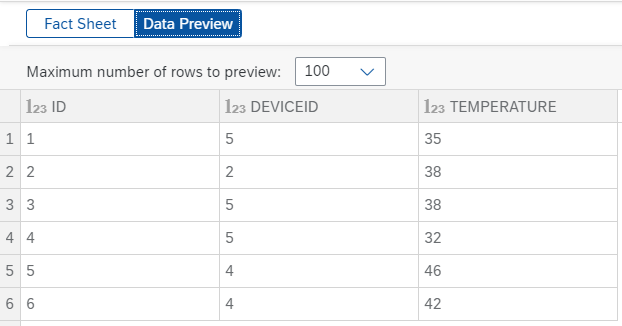

# Buid Log-based integration with SAP Data Intelligence

Log-based integration is getting popular for integrating different data systems. By capturing the changes in a database and continually apply the same changes to derived data systems, the data in the derived systems is match with the data in the database as long as the message ordering of changed data stream is preserved. The derived data systems are consumers of the changed data stream, as illustrated in below figure.  

> The derived data systems are downstream consumers, in practice, they might be indexes, caches, analytics systems, etc. 

In this toturial, we want to explore how to achieve data integration between soure database and various other derived data systems using a log-based approach in SAP Data Intelligence.

In order to build a log-based intergtation approach, we need two critical compotents:
- A CDC tool for capturing database changes.
- A message borker for persisting messages stream while preserving the message ordering.

SAP Data Intelligence provides hundreds of out-of-box operators for user to choose and combine them into a powerful data pipline to implement data driven application. Now Let's see how SAP Data Intelligence's built-in operators can satisfy above two requirements.

### CDC
Change data capture(CDC) is the process of observing all data changes written to a database and extracting them in a form in which they can be replicated to other systems. 

SAP Data Intelligence 3.0 introduced the table Replicator operator which allows capturing delta changes for different databases. Besides capturing the delta, this operator also handles applying the changes to a target table, allowing replication of tables in an efficient and secure way, through an in-built recovery mechanism.

Table Replicator operator effectively implements the concept of change data capture(CDC) using an approach of trigger-based replication. For more detail, see https://help.sap.com/viewer/97fce0b6d93e490fadec7e7021e9016e/Cloud/en-US/79fcadb91f584f868a6662111b92f6e7.html.

### Kafka
Apache Kafka is a message broker which provides a total ordering of the messages inside each partition. A partition lives on a physical node and persists the messages it receives.

SAP Data Intelligence has built-in Kafka producer/consumer operators.

## Getting started
Now we have our tools ready, let's see how to implement a concret integration scenario.

For the soure database table, its table schema is illustrated as below.  

The table records are illustrated below.  

As you can see, the table initially contains 6 records.
> For simplicity, we only use factitious data for demonstration purpose.

We would first do an initial load to load all the 6 records to a file in Data Intelligence local file system. Then Continuously capture the subsequent table changes into a Kafka topic, and further apply the changes to the downstream operators.

Our approach involves two sequential tasks playing different roles.
1. Initial loading source table data.
2. Continuously capture source table changes(Delta extraction).

We will create separate graphs for these two tasks.

## Initial loading [(Graph source code)](https://github.com/Andyyh2005/log-based-integration-with-DI/blob/master/src/vrep/vflow/graphs/CDC_InitialLoading_test/graph.json)
The following figure illustrates the initial loading graph:  

The configuration of the table replicator operator is illustrated as below.  

Some of the important cofiguration parameters are marked in red box.
> Note that the **deltaGrapMode** is set to Manual. This ensures the graph would finish its execution once the intial loading completed. Otherwise, the graph would run indefinitely to track further delta changes.

Now run the graph and verify the target file has been generated.  

Also, open the file and verify the table content has been replicated to the target file successfully.  

Now we see that our initial loading task has been finished successfully. let's turn to the Delta extraction task.

## Delta extraction[(Graph source code)](https://github.com/Andyyh2005/log-based-integration-with-DI/blob/master/src/vrep/vflow/graphs/CDC_InitialLoading_test/graph.json)
The following figure illustrates the Delta extraction graph:  

Let's take an overview of the dataflow sequence of this grpah.
- The constant generator operator will trigger the Table Replicator to begin the CDC delta tracking once the graph start running.
- The Table Replicator operator(labeled as "CDC (delta tracking)") will replicated the database changes to a tagret file. 
- The Read File operator(labeled as "Read Delta File")will read the target file content and send its content to downstream JS operator.
- The JS operator(labeled as "Parse & send changes") will parse the received file content and send the parsed change message into Kafka.
- The downstream Kakfa Producer operator will receieve the incoming messages and publish them into the specified topic on the Kafka cluster.
- The Kafka Consumers subscribe the specified topic and consume the messages from the Kafka cluster.
- The Connected Wiretap opertor(labeled as "Change consumer1" and "Change consumer2") acts as the derived data system applying the change messages.

Now let's take a look at the configuraion of some operators in this graph.

### Table Replicator
We name is as "CDC (delta tracking)". Its configuration is illustrated as below.  

Some of the important cofiguration parameters are marked in red box.
> Note that the **deltaGrapMode** is set to Manual. This ensures the graph would finish its execution once the intial loading completed. Otherwise, the graph would run indefinitely to track further delta changes.
